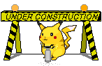

<h1 align="center">Diego García</h1>
<h3 align="center">Ⅺ</h3>
<h3 align="center">Software Engineering Student at University of Oviedo</h3>

##  Sobre mí

⛰️🌊 Desarrollador independiente, guionista y aventurero a tiempo parcial

🔭 Actualmente estudiando en: **Escuela de Ingeniería Informatica del Software, UNIOVI**

💬 Pregúntame sobre: Como sacar una ingeniería sin fallecer en el intento.

  

# Tecnologías y Herramientas

### Programming Languages

### Front-End Development

  

### Back-End Development

  

### Database

### Devops

### Others

<picture>
  <source media="(prefers-color-scheme: dark)" srcset="https://raw.githubusercontent.com/tobiasmeyhoefer/tobiasmeyhoefer/output/github-snake-dark.svg" />
  <source media="(prefers-color-scheme: light)" srcset="https://raw.githubusercontent.com/tobiasmeyhoefer/tobiasmeyhoefer/output/github-snake.svg" />
  
</picture>

# 📊 GitHub Stats:
 
 

## 🏆 GitHub Trophies

  

